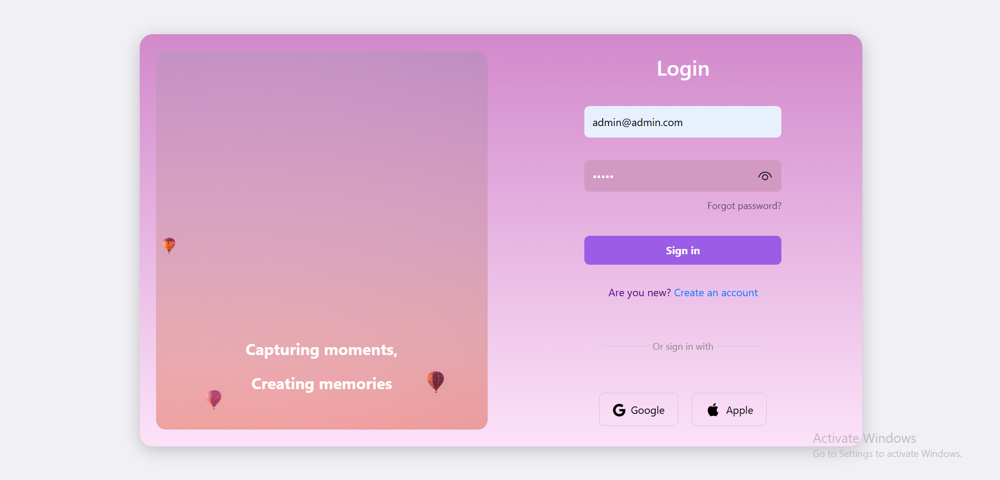
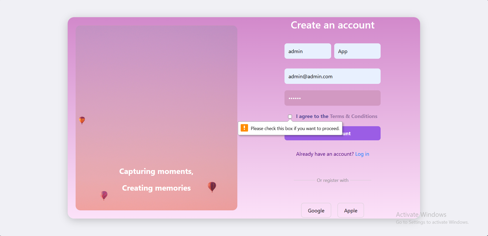
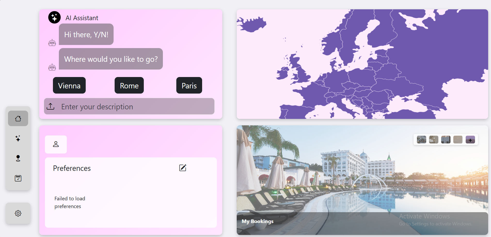
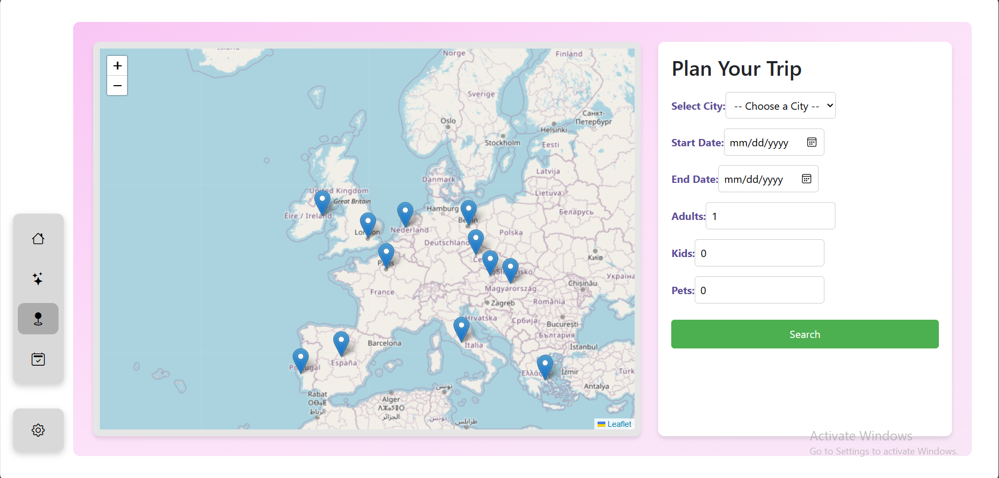
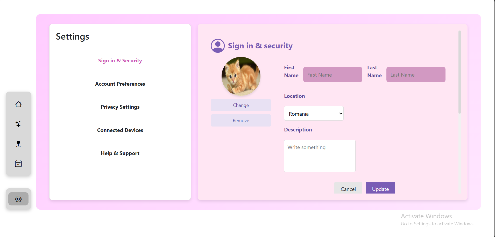
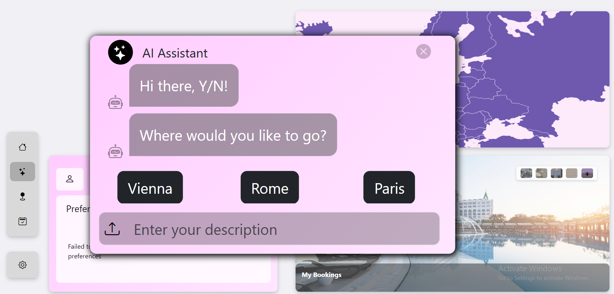

# AI-Powered Booking System

Overview
The AI-Powered Booking System is a full-stack web application designed to streamline booking and scheduling processes for various services. It leverages a modern technology stack with a Java Spring Boot backend, a React (Vite) frontend, and AI-powered automation built with Python. The system provides users with an intuitive interface to manage bookings while utilizing AI-driven insights for optimization and recommendations.

## 📌 **Tech Stack**  

### **Backend: Java Spring Boot**  
- 🌐 **Spring Boot** - RESTful API development  
- 🔐 **Spring Security** - JWT authentication & authorization  
- 🗄 **JPA/Hibernate** - Database management (MySQL)  
- ⚡ **WebSockets** - Real-time updates & notifications  

### **Frontend: React with Vite**  
- ⚛ **React.js** - Fast and interactive UI  
- ⚡ **Vite** - Lightning-fast development build  
- 🎨 **Tailwind CSS / Material UI** - Modern UI components  
- 🔄 **React Router** - Seamless navigation  

### **AI Module: Python (Machine Learning & NLP)**  
- 🤖 **AI-powered booking suggestions**  
- 📊 **Demand prediction & analytics**  
- 💬 **Chatbot integration (NLP)**  
- 🔌 **REST API communication** with backend  

---
## 📸 Screenshots  

  
  
  

  
  
  

---
## 👥 Contributors  

Thanks to these amazing people who helped build this project!  

<table>
  <tr>
    <td align="center">
      <a href="https://github.com/CosminPetriuc">
        
         
        <b>CosminPetriuc</b>
      </a>
    </td>
    <td align="center">
      <a href="https://github.com/wasy2023">
        
         
        <b>wasy2023</b>
      </a>
    </td>
    <td align="center">
      <a href="https://github.com/NeaguGeorgianaTeodora">
        
         
        <b>NeaguGeorgianaTeodora</b>
      </a>
    </td>
    <td align="center">
      <a href="https://github.com/andrapavel">
        
         
        <b>andrapavel</b>
      </a>
    </td>
    <td align="center">
      <a href="https://github.com/sorana134">
        
         
        <b>sorana134</b>
      </a>
    </td>
    <td align="center">
      <a href="https://github.com/Azeks0">
        
         
        <b>Azeks0</b>
      </a>
    </td>
  </tr>
</table>
